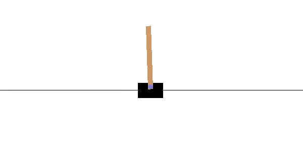
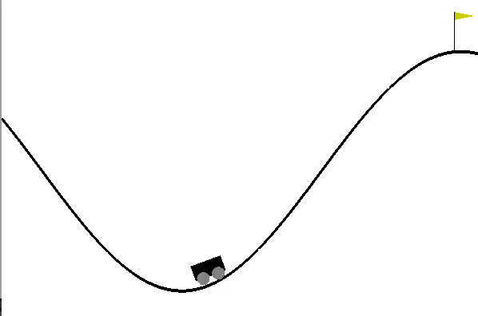

# Quantum_RL
## Quantum Computing (PL3001) - Sem 6

Reinforcement Learning (RL) has established itself as a powerful paradigm for solving sequential decision-making problems, where an agent learns to make decisions by interacting with an environment to maximize cumulative rewards. Traditional RL approaches, such as Deep Q-Learning (DQN), have demonstrated remarkable success in various complex tasks, including the classic control problems of Cart Pole, Mountain Car, and Acrobot, which are commonly used benchmarks provided by OpenAI Gym. However, as RL continues to evolve, the exploration of novel techniques that could further enhance performance and efficiency remains an active area of research. 

Recent advancements in quantum computing have opened up new possibilities for integrating quantum mechanisms into classical machine learning algorithms. Parameterized Quantum Circuits (PQC) offer a promising approach to harnessing the expressive power and potential quantum advantages in RL frameworks. PQCs are particularly appealing because they can be used as function approximators or policy models, potentially leading to more efficient learning processes and better generalization.

In this work, we focus on comparing the baseline implementations of Cart Pole, Mountain Car, and Acrobot environments using traditional DQN with their PQC-enhanced variants. Specifically, we explore two quantum RL methodologies: PQC-enhanced Policy Gradient and PQC-enhanced Deep Q-Learning. Our objective is to thoroughly summarize existing works, extend them by integrating PQCs, build our own implementations, and provide a comparative analysis of the performance of quantum RL versus classical RL across these benchmark environments.

The Cart Pole environment is a classic control problem where the agent must balance a pole attached to a cart by applying forces to the cart. Mountain Car involves an agent that must drive a car up a steep hill, and Acrobot requires the agent to swing up a two-link robotic arm to a vertical position. These environments are well-suited for studying the efficacy of RL algorithms due to their simplicity and the richness of the control challenges they present.

 

Our study contributes to the field by implementing and rigorously evaluating the following approaches:
1. **Baseline DQN Implementations:** We implement the standard DQN algorithm for Cart Pole, Mountain Car, and Acrobot using the OpenAI Gym environments. These serve as the benchmarks for our comparison.
2. **PQC-Enhanced Policy Gradient:** For each environment, we implement a policy gradient method enhanced with PQCs to directly optimize the policy through interaction with the environment.
3. **PQC-Enhanced Deep Q-Learning:** We also implement a DQN algorithm where PQCs are used as function approximators for the Q-values, thereby integrating quantum operations within the Q-network.

We provide a detailed analysis of the performance of each approach by plotting the learning curves and evaluating the average rewards over training episodes. Our results highlight the potential advantages of quantum-enhanced RL, particularly in terms of learning efficiency and robustness.

By comparing these implementations, we aim to elucidate the benefits and challenges of integrating quantum computing into RL frameworks. Our findings indicate that PQC-enhanced RL algorithms can outperform traditional methods in specific scenarios, showcasing the promise of quantum technologies in advancing the state-of-the-art in reinforcement learning. This comparative study lays the groundwork for future research in quantum-enhanced machine learning and its applications in control and decision-making tasks.

**To run the implementations, please clone the repository and run the notebooks on Google Colab (to ensure the dependency mismatch is mitigated).**

- **Our Implementations:** This folder holds the six implementations (2 variants in each notebook) of the three scenarios from the OpenAI Gym.
- **Our Results:** The Training plots obtained upon running the implementations can be found here.
- **Baseline Implementations:** This folder hosts the three baseline classical implementations to compare our implementations of the QRL variants.
- **Baseline Results:** The Training plots obtained upon executing the Baseline Implementations can be found here.
- **QC Reports:** The Reports detailing the implementations and the methodologies can be found here.
- **Literature:** For the love of the project, the detailed intuition, gory math, and the foundations can be found here.
- **Miscellaneous:** Our incomplete (for now) implementations and some crazy experiments can be found here!

*Live it and Love it! Quantum Reinforcement Learning!*

- Rahath Malladi and Arshia Sangwan
